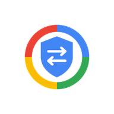

# BluBox

  

<h3 align="center">An open-source proxy client for Android.</h3>

  Based on NekoBox for Android, powered by the sing-box core.

  <a href="https://github.com/BoxNest/BluBox/releases/latest">Download</a> ·
  <a href="https://github.com/BoxNest/BluBox/releases">Releases</a> ·
  <a href="https://github.com/BoxNest/BluBox/issues">Issues</a>

---

## About

BluBox is an open-source proxy client for Android. It is based on
[NekoBox for Android](https://github.com/MatsuriDayo/NekoBoxForAndroid)
and powered by the [sing-box](https://github.com/SagerNet/sing-box) core.

BluBox keeps the networking capabilities of sing-box in a familiar
Android interface, so you can manage profiles, groups and routing
rules in one place.

BluBox ships with **no built-in proxy servers or subscriptions**.
You import and use your own configurations.

## Features

- Android VPN (TUN) integration
- Multiple proxy protocols, as supported by the bundled sing-box core
  and exposed by the app
- Subscription and profile management
- Proxy groups and rule-based routing
- DNS configuration
- IPv4 and IPv6 support
- Import and export of configurations

The exact feature set may vary depending on the bundled sing-box
version and the current app release.

## Download

Get the latest APK from
[GitHub Releases](https://github.com/BoxNest/BluBox/releases/latest).

Check the release assets for the build that matches your device.

## Built With

- Android (Kotlin)
- [NekoBox for Android](https://github.com/MatsuriDayo/NekoBoxForAndroid)
- [sing-box](https://github.com/SagerNet/sing-box) (Go)

## Open Source

BluBox is free and open-source software released under the
GNU General Public License v3.0.

This project is a modified work based on NekoBox for Android.
Please refer to the upstream projects for their respective
copyright and license information.

## Disclaimer

BluBox is a networking tool intended for legitimate purposes.

Users are responsible for complying with the laws and regulations
applicable to their location and network environment.

## Credits

BluBox would not be possible without the open-source community.

Special thanks to:

- [NekoBox for Android](https://github.com/MatsuriDayo/NekoBoxForAndroid) and its contributors
- [sing-box](https://github.com/SagerNet/sing-box) and its contributors
- The Android Open Source Project
